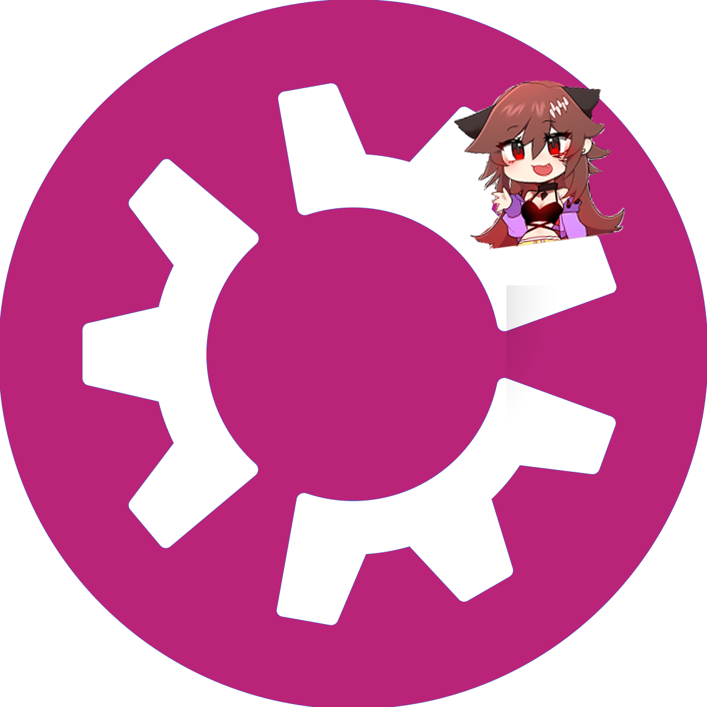

<table border="0">
  <tr>
    <!-- This cell puts the logo in that empty space on the left -->
    <td width="160" align="center" valign="top">
      
    </td>
    <!-- This cell holds all your project information -->
    <td valign="top">
      <h1>crydiaaos</h1>
      
Official website for <b>Crydiaa! OS</b> - A passion project by a solo developer dedicated to blending high-performance computing with the signature Crydiaa aesthetic. Built for users who want a distro that looks as good as it runs, Crydiaa! OS is optimized for daily use without compromising on style. I will try to make version 1.0 polished and usable as a daily driver.

      

        <b>version 0.3:</b> <a href="https://drive.google.com/file/d/1_gO3HTZC16EaiDuvwg-TABHm9CY_BoRu/view?usp=sharing">Download ISO</a>
      

      

        <b>version 0.2 (outdated):</b> <a href="https://drive.google.com/file/d/1z_hiHz6TqwzPp1r3p0MY5spoUYb6J20D/view?usp=sharing">Download ISO</a> 
        <i>Username: crydiaa | Password: 1234</i>
      

    </td>
  </tr>
</table>
https://drive.google.com/file/d/1bV_9aqbSXVztFvv4FIaZjqqLh3j9jEx9/view?usp=sharing
